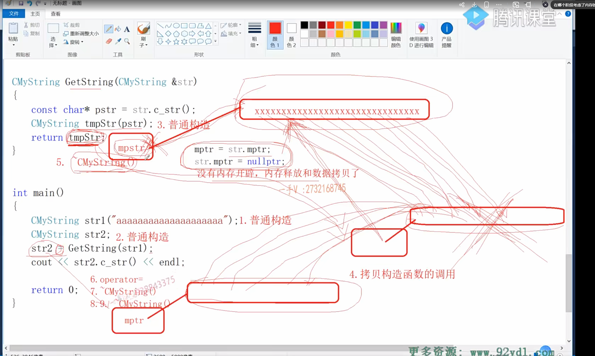
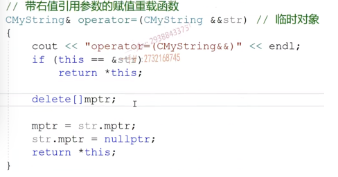
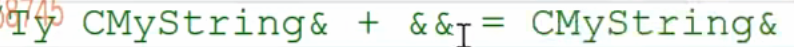
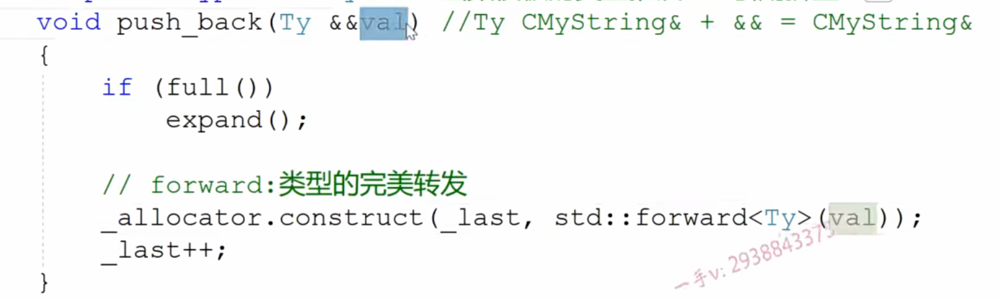
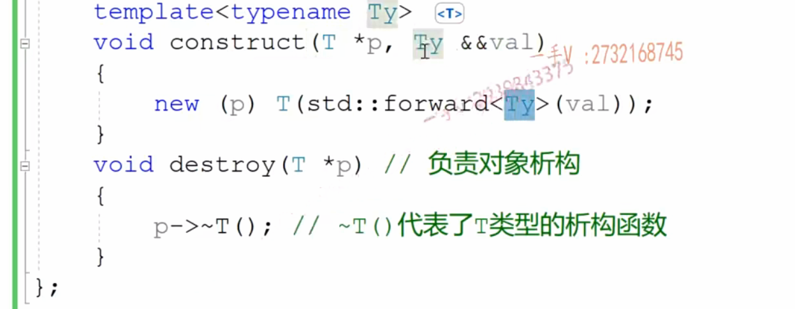

在传递类的时候，需要遵守的三点

代码中出现的问题：get函数中先创建对象再返回

main中 先定义再初始化

如果必须这么写，需要用方法优化

 

例：提供右值引用的拷贝构造函数和赋值重载函数

Std::move() 强转成右值引用

 

引用折叠：

Ty CMyString && + && = CMyString &&

 

Std::forward():类型的完美转发 能够识别左值和右值引用

需要使用模板才能使用forward

