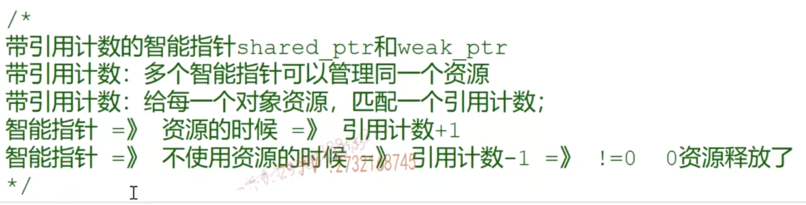
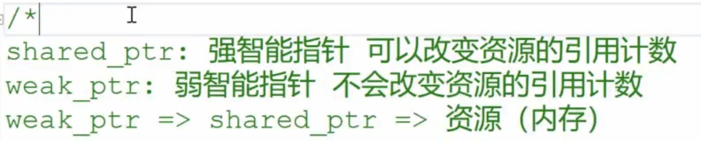
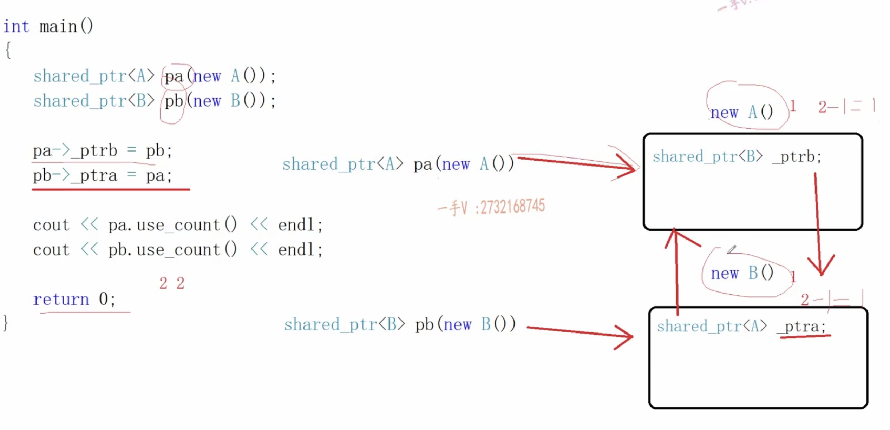
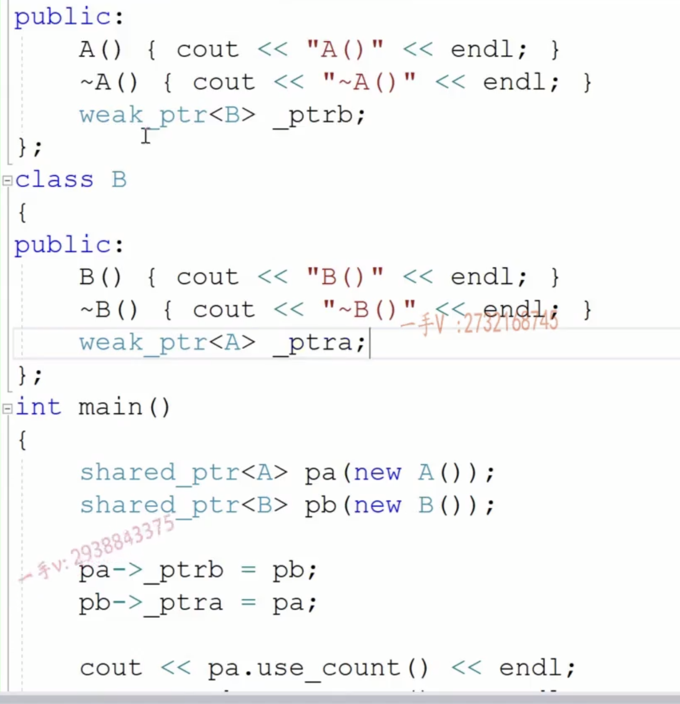
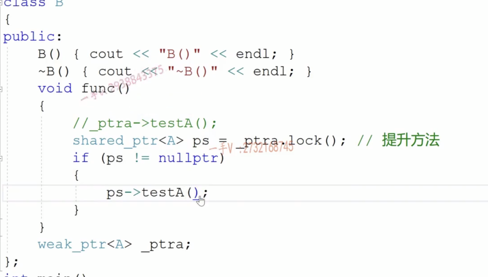

 

解决浅拷贝：

Auto_ptr 解决方法：永远让最后一个指针管理资源  （转移对象所有权）

不推荐使用auto_ptr 不可以在容器中使用auto_ptr

Scoped_ptr 删除了拷贝构造和赋值函数

Unique_ptr

带引用计数的智能指针

shared_ptr weak_ptr都是线程安全的

定义对象的时候使用强智能指针

引用对象的时候使用弱智能指针

弱智能指针智能起到观察的作用，起没有*和->重载 无法当成正常的智能来使用

弱指针的提升方法如图