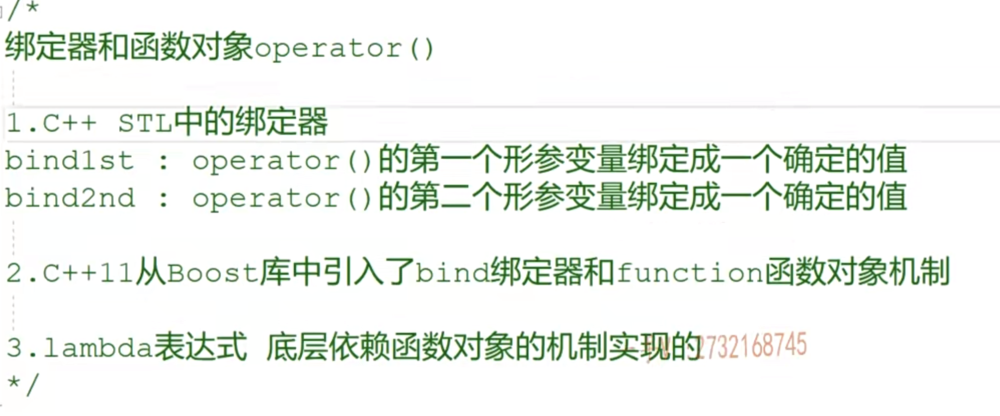

bind1st和bind2nd在cpp17标准中已经弃用，因此我将学习std::bind

```c++
using namespace std::placeholders; // 引入占位符命名空间，方便书写

// 1. 相当于以前的 bind2nd：把第二个参数固定为 10
auto minus_ten = std::bind(print_minus, _1, 10);
minus_ten(50); // 输出: 50 - 10 = 40

// 2. 相当于以前的 bind1st：把第一个参数固定为 100
auto hundred_minus = std::bind(print_minus, 100, _1);
hundred_minus(20); // 输出: 100 - 20 = 80
```


```cpp
// 交换参数顺序：新函数的第一个参数传给原函数的 b，第二个传给 a
auto reversed_minus = std::bind(print_minus, _2, _1);
reversed_minus(10, 50); // 实际调用 print_minus(50, 10)，输出: 50 - 10 = 40
```


```cpp
class MyMath {
public:
    void multiply(int a, int b) {
        std::cout << "Result: " << a * b << std::endl;
    }
};

MyMath math_obj;
// 绑定成员函数：参数依次为 -> &类名::函数名, 对象地址, 原函数的参数...
auto bind_member = std::bind(&MyMath::multiply, &math_obj, _1, 5);

bind_member(10); // 实际执行 math_obj.multiply(10, 5)，输出: Result: 50
```

